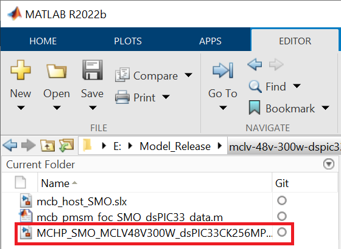
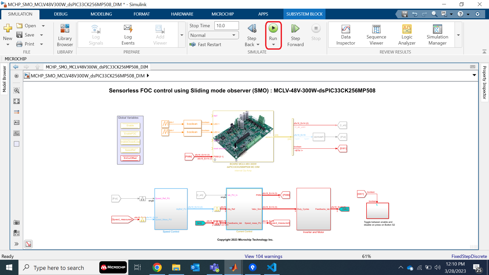

 

# MATLAB MCLV-48V-300W dsPIC33CK256MP508 FOC OPTICAL ENCODER

## 1. INTRODUCTION

This document describes the setup requirements for running the Sensorless FOC algorithm with a Sliding Mode Observer (SMO), using MATLAB/Simulink and Motor Control Low-Voltage 48V-300W Inverter Board.

## 2.	SUGGESTED DEMONSTRATION REQUIREMENTS
### 2.1 MATLAB Model Required for the Demonstration
-  MATLAB model can be cloned or downloaded as zip file from the Github repository ([link](https://github.com/microchip-pic-avr-solutions/matlab-mclv-48v-300w-dspic33ck256mp508-foc-opticalencoder)).

### 2.2	Software Tools Used for Testing the MATLAB/Simulink Model
1.	MPLAB X IDE and IPE (v6.0)
2.	XC16 compiler (v2.00)
3.	MATLAB R2022b
4.	Required MATLAB add-on packages
    -	Simulink (v10.6)
    -	Simulink Coder (v9.8)
    -	Stateflow (v10.7)
    -	MATLAB Coder (v5.5)
    -	Embedded Coder (v7.9)
    -	MPLAB Device blocks for Simulink (v3.50.35)
    -   Motor Control Blockset (v1.5)

> **_NOTE:_**
>The software used for testing the model during release is listed above. It is recommended to use the version listed above or later versions for building the model.

### 2.3	Hardware Tools Required for the Demonstration
- Motor Control Low-Voltage 48V-300W Inverter Board ([EV18H47A](https://www.microchip.com/en-us/development-tool/EV18H47A))
- dsPIC33CK256MP508 Motor Control Dual In-line Module (EV62P66A)
- 24V Power Supply ([AC002013](https://www.microchipdirect.com/dev-tools/AC002013)) 
- 24V, 3-Phase Brushless DC Permanent Magnet Hurst Motor ([AC300022](https://www.microchip.com/en-us/development-tool/AC300022))

> **_NOTE:_**
>All items listed under this section Hardware Tools Required for the Demonstration are available at [microchip DIRECT](https://www.microchipdirect.com/).

  
## 3. HARDWARE SETUP

This section describes hardware setup required for the demonstration.

1. 
 Connect the 3-phase wires from the motor to PHA, PHB, and PHC of the J4 connector, provided on the MCLV-48V-300W Inverter Board.

    

    

    
2. Insert the **dsPIC33CK256MP508 Motor Control DIM** into the DIM Interface **connector J8** on the MCLV-48V-300W Inverter Board. Make sure the DIM is placed correctly and oriented before going ahead.

     

     

4. Plug the 24V power supply to **connector J1** on the MCLV-48V-300W Inverter Board. Alternatively, the Inverter Board can also be powered through connector J3.
      

      

 

 5. The board has an onboard programmer **PICkit™ On Board (PKoBv4)** , which can be used for programming or debugging the microcontroller or dsPIC DSC on the DIM. To use the onboard programmer, connect a micro-USB cable between the Host PC and **connector J16** on the MCLV-48V-300W Inverter Board.
      

     

 6. Alternatively, connect the Microchip programmer/debugger MPLAB® PICkit™ 4 In-Circuit Debugger between the Host PC used for programming the device and the **ICSP header J9** on the MCLV-48V-300W Inverter Board (as shown). Ensure that PICkit 4 is oriented correctly before proceeding.
      

       

 
  

## 4.	BASIC DEMONSTRATION

 Follow the below instructions step-by-step, to set up and run the motor control demo application:

1. Launch MATLAB (refer the section [“2.2 Sofware Tools Used for Testing the MATLAB/Simulink Model"](#22-software-tools-used-for-testing-the-matlabsimulink-model)).
 
2. Open the folder downloaded from the repository, in which MATLAB files are saved (refer the section ["2.1 MATLAB Model Required for the Demonstration"](#21-matlab-model-required-for-the-demonstration)).

    

    

3.	
 Double click and open the .m file. This .m file contains the configuration parameter for the motor and board. By default, the .m file is configured to run Hurst 300 motor and MCLV-48V-300W Inverter Board. Run the file by clicking the <b>“Run”</b> icon and wait till all variables gets loaded on the <b>‘Workspace’</b> tab.

    

      

    

4.	
Double click on the FOC Simulink model.

    

      

    

5.	
This opens the FOC Simulink model as shown below. Click on the <b>"Run"</b> icon to start the simulation.

    

      

    

6.	
To plot the simulation result, <b>Data Inspector</b> is used (refer to figure below). To observe the additional signals, log them as required. Alternatively, normal Simulink Scope can be used to plot the signals.

    

      

    

7.	
From this Simulink model an MPLAB X project can be generated, and it can be used to run the PMSM motor using MCLV-48V-300W Inverter Board. 
To generate the code from the Simulink model, go to the <b>"MICROCHIP"</b> tab, and enable the tabs shown in the figure below. 

    

      

    

8.	
	To generate the code and run the motor, click on <b>‘Build Model’ or ‘Clean Build Model’</b> option under the <b>“Microchip”</b> tab. This will generate the MPLAB X project from the Simulink model and program the dsPIC33CK256MP508 device.

    

      

    

9.	
After completing the process, the <b>‘Operation Succeeded’</b> message will be displayed on the <b>‘Diagnostics Viewer’</b>.

    

      

    

10.	
If the device is successfully programmed, <b>LED- LD2 and LD3</b> will be blinking.

11.	
Keep the potentiometer (<b>POT1</b>) position at the middle. Then, to Run the motor, press the push button <b>SW1</b>.

    

      
 
    

12.	
In this model, the motor is enabled to run in both clockwise and anticlockwise direction. The reference speed of it set by the potentiometer (<b>“POT1”</b>). The zero-reference speed is the mid-point of the POT1, vary the POT1 in either direction to increase the motor speed in the corresponding direction.

    

      

    

13.	Press the push button <b>SW1</b> to stop the motor.

    

      

    

## 5.	DATA VISUALIZATION USING MOTOR CONTROL BLOCKSET (MCB) HOST MODEL

The FOC model comes with the initialization required for data visualization using Motor Control Blockset Host Model (MCB Host Model). The MCB Host Model is a Simulink model which facilitates data visualization through the UART Serial Interface. 

1.	
To establish serial communication with the host PC, connect a micro-USB cable between the host PC and the MCLV-48V-300W Inverter Board (J16 connector). This interface is used for programming as well.
    

      

    

2. Ensure that the FOC model is programmed and running as described under section ["4. Basic Demonstration"](#4-basic-demonstration) by following steps 1 through 13.

3. 
Open the MCB Host model and double click on the <b>“Serial Setup”</b> block. Then select the appropriate COM port connected to the hardware from the drop-down menu and set the baud rate as 460829. Please note that the same baud rate is required to be chosen in the FOC model (the baud rate can be viewed on the <b>“UART Configuration”</b> block in the <b>“MCLV-48V-300W Board Template”</b>).

    

      

    

4.	
Open the <b>“UART_Rx”</b> subsystem to configure the COM port. This can be done by configuring the <b>“Host Serial Receive”</b> block of the “UART_Rx” subsystem. Ensure to select the same COM port configured in step 3. 

    

      

    

5.	
Click the run icon of the MCB Host model to open the scope window and monitor the signals.

    

      

    

6.	
In the figure below, one example is shown where two signals (measured and reference speeds) have been plotted.

    

      

    

## 	6. REFERENCES:
For more information, refer to the following documents or links.
1.	Motor Control Low-Voltage 48V-300W Inverter Board ([EV18H47A](https://www.microchip.com/en-us/development-tool/EV18H47A)) 
2. dsPIC33CK256MP508 Motor Control Dual In-line Module (EV62P66A)
3.	[MPLAB® X IDE installation](https://microchipdeveloper.com/mplabx:installation)
4.	[MPLAB® XC16 Compiler installation](https://microchipdeveloper.com/mplabx:installation)
5.  [Motor Control Blockset](https://in.mathworks.com/help/mcb/)
6.  [MPLAB Device Blocks for Simulink :dsPIC, PIC32 and SAM mcu](https://in.mathworks.com/matlabcentral/fileexchange/71892-mplab-device-blocks-for-simulink-dspic-pic32-and-sam-mcu)

